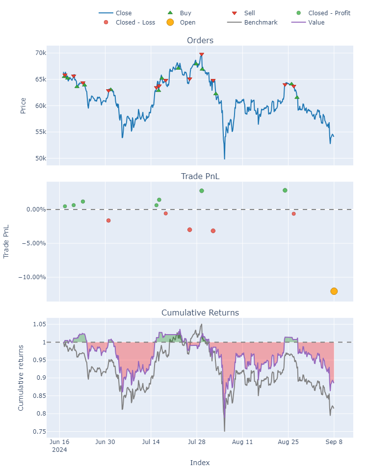
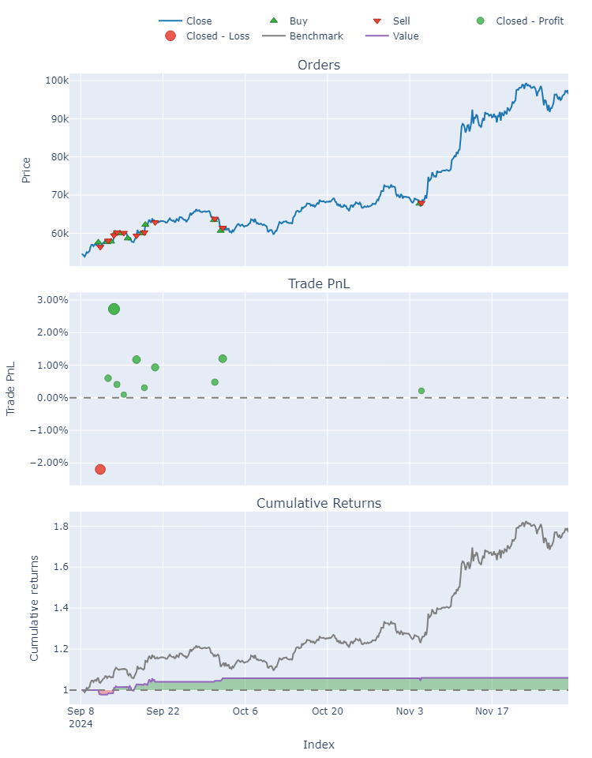
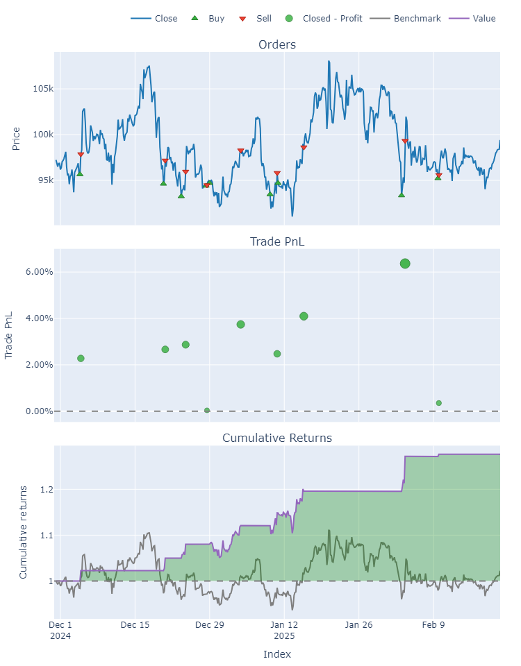

# AlphaFlow ML & DL Trading Bot Project

A comprehensive **machine learning and deep learning trading framework** that covers the entire workflow:

1. **Data loading** from MetaTrader 5
2. **Feature engineering** (technical indicators, custom features, labeling)
3. **Model training** (RandomForest, XGBoost, LightGBM, deep learning models, etc.)
4. **Hyperparameter tuning** (RandomizedSearchCV or GridSearchCV)
5. **Time-based / walk-forward cross-validation**
6. **Backtesting** (VectorBT or simple custom code)
7. **Live trading** integration with MetaTrader 5

### Supported Labeling Strategies:
- **Regression** on next-bar returns
- **Multi-bar classification**
- **Double-barrier labeling** (López de Prado style)
- **Regime detection** (simple up/down/sideways approach)

This project provides a flexible **template** for you to **create and add your own** custom labeling functions or feature engineering steps, allowing you to experiment with new ideas and strategies.

## Table of Contents
1. [Features](#features)
2. [Repository Structure](#repository-structure)
3. [Setup & Installation](#setup--installation)
4. [Usage](#usage)
    - Backtesting Notebooks
    - Live Trading Scripts
5. [Key Modules](#key-modules)
6. [Extending the Project](#extending-the-project)
7. [Disclaimer](#disclaimer)
8. [License](#license)

## Features
- **MetaTrader 5** data retrieval (`data_loader.py`)
- **TA** library for feature engineering (`ta.add_all_ta_features`)
- Multiple **labeling methods**: next-bar, multi-bar, double-barrier, regime detection, etc.
- **Time-based** or **walk-forward** cross-validation to avoid data leakage
- **RandomizedSearchCV** or **GridSearchCV** for hyperparameter tuning
- **VectorBT** or custom backtesting scripts for performance evaluation
- **Live trading** scripts with real-time MetaTrader 5 order sending

## Repository Structure
```bash
ml_bot_trading/
├── data/
│   ├── data_loader.py  # MetaTrader 5 data retrieval
│
├── features/
│   ├── feature_engineering.py  # Technical indicators, custom features
│   ├── labeling.py  # Labeling methods: next-bar, multi-bar, double-barrier, regime detection
│
├── models/
│   ├── model_training.py  # Model selection, hyperparam tuning
│   ├── saved_models/  # Folder for .pkl pipelines (best_rf_pipeline.pkl, etc.)
│
├── backtests/
│   ├── simple_backtest.py  # Simple Pythonic backtest logic
│   ├── vectorbt_backtest.py  # VectorBT-based backtesting template
│
├── live_trading/
│   ├── regression_returns.py  # Live trading script for regression returns
│   ├── multi_bar.py  # Live trading script for multi-bar classification
│   ├── double_barrier.py  # Live trading script for double-barrier labeling
│   ├── regime_detection.py  # Live trading script for regime detection
│
├── ml_notebooks/
│   ├── 01_backtests_regression_returns.ipynb
│   ├── 01_live_trading_regression_returns.ipynb
│   ├── 02_backtests_multi_bar_classification.ipynb
│   ├── 02_live_trading_multi_bar.ipynb
│   ├── 03_backtests_double_barrier.ipynb
│   ├── 03_live_trading_double_barrier.ipynb
│   ├── 04_backtests_regime_detection.ipynb
│   ├── 04_live_trading_regime_detection.ipynb
│
├── dl_notebooks/
│   ├── 01_backtests_regression_returns dl.ipynb
│   ├── 01_live_trading_regression_returns dl.ipynb
│ 
├── requirements.txt
├── README.md
```

## Setup & Installation

### 1. Clone this repository:
```bash
git clone https://github.com/maghdam/AlphaFlow-Trading-Bot.git
cd ml_bot_trading
```

### 2. Create and activate a Python environment (conda or venv):
```bash
conda create -n ml_trading python>=3.9
conda activate ml_trading
```

### 3. Install dependencies:
```bash
pip install -r requirements.txt
```
- Make sure you have **MetaTrader5** installed if you plan to do live trading.

### 4. (Optional) Install Jupyter Notebook:
```bash
pip install jupyter
```

## Usage
### Backtesting Notebooks
1. Navigate to `ml_notebooks/` or `dl_notebooks/`, pick a relevant file (e.g., `02_backtests_multi_bar_classification.ipynb`), and run it:
   ```bash
   jupyter notebook
   ```
2. Inside the notebook, you can see how we do:
   - Feature engineering
   - Labeling
   - Walk-forward splits
   - Train & tune
   - VectorBT or custom backtesting

### Live Trading Scripts
1. Navigate to `ml_notebooks/` or `dl_notebooks/`, pick a relevant live trading file (e.g., 2_live_trading_multi_bar_classification.ipynb), or go to `live_trading/` folder and pick the script for your labeling approach:
   - `regression_returns.py`
   - `multi_bar.py`
   - `double_barrier.py`
   - `regime_detection.py`
2. Adjust **MetaTrader 5 credentials** (login, server, password) in the script.
3. Run from terminal:
   ```bash
   python live_trading/multi_bar.py.py
   ```
4. The script will:
   - Load the pipeline (e.g., `best_rf_mb_pipeline.pkl`)
   - Fetch new bars from MetaTrader 5
   - Predict SHIFTED classes `[0, 1, 2]` => SHIFT back to `[-1, 0, +1]`
   - Place orders if signals = ±1

## Key Modules
- **`data/data_loader.py`**: Connects to MetaTrader 5, fetches bars with `copy_rates_from_pos`.
- **`features/feature_engineering.py`**: Uses the **TA** library and additional custom features (spreads, autocorrelation, etc.).
- **`features/labeling.py`**:
  - `calculate_future_return(...)`
  - `create_labels_multi_bar(...)`
  - `create_labels_double_barrier(...)`
  - `create_labels_regime_detection(...)`
- **`models/model_training.py`**:
  - `select_features_rf_reg(...)`
  - Time-based splits, random/grid search for hyperparams.
- **`backtests/`**:
  - `simple_backtest.py` or `vectorbt_backtest.py`
- **`live_trading/`**:
  - Each script loads a pipeline (`.pkl`), connects to MT5, and places trades based on predictions.

## Extending the Project
- **Add your own label**: Create a new function in `features/labeling.py` (e.g. `create_labels_custom(...)` that returns a new column with `[-1, 0, +1]` (or your custom classes)).
- **Add your own features**: Implement them in `features/feature_engineering.py` or create a new file.
- **Train a new model**: Adapt `models/model_training.py` or your notebooks to handle new classifiers/regressors.
- **Explore new backtest approaches**: Either integrate with `vectorbt` in a notebook or write a custom `.py` in `backtests/`.

## Disclaimer
We share this code for **learning and development/research purposes only**. Nothing herein constitutes financial advice or a recommendation to trade real money. **Trading involves substantial risk.** Always do your own due diligence, consult professionals, and only risk capital you can afford to lose.

## License
This project is licensed under the **MIT License** - see the [LICENSE](LICENSE) file for details.


## Backtest Results - 3 Folds

Number of folds: 3
Loaded best pipeline from 'best_rf_mb_pipeline.pkl'

### **=== Fold 1 ===**
```
Train size: 498, Test size: 498
Fold 1 Accuracy=0.42
Fold 1 Return=-0.11%, Sharpe=-0.65
```

Vectorbt stats for Fold 1

```
Start                         2024-06-17 04:00:00
End                           2024-09-08 00:00:00
Period                           83 days 00:00:00
Start Value                               10000.0
End Value                             8859.141834
Total Return [%]                       -11.408582
Benchmark Return [%]                   -18.492533
Max Gross Exposure [%]                      100.0
Total Fees Paid                          50.48857
Max Drawdown [%]                        23.924092
Max Drawdown Duration            47 days 04:00:00
Total Trades                                   13
Total Closed Trades                            12
Total Open Trades                               1
Open Trade PnL                       -1215.304101
Win Rate [%]                            58.333333
Best Trade [%]                           2.828353
Worst Trade [%]                         -3.149463
Avg Winning Trade [%]                    1.419101
Avg Losing Trade [%]                     -1.79597
Avg Winning Trade Duration        5 days 20:00:00
Avg Losing Trade Duration         3 days 04:48:00
Profit Factor                            1.081272
Expectancy                               6.203828
Sharpe Ratio                            -0.646279
Calmar Ratio                            -1.726226
Omega Ratio                              0.953241
Sortino Ratio                            -0.87177
dtype: object
```




### **=== Fold 2 ===**

```
Train size: 996, Test size: 498
Fold 2 Accuracy=0.31
Fold 2 Return=0.06%, Sharpe=2.22
```

Vectorbt stats for Fold 2

```
Start                         2024-09-08 04:00:00
End                           2024-11-30 00:00:00
Period                           83 days 00:00:00
Start Value                               10000.0
End Value                            10602.511354
Total Return [%]                         6.025114
Benchmark Return [%]                    77.078981
Max Gross Exposure [%]                      100.0
Total Fees Paid                         44.942643
Max Drawdown [%]                         2.218465
Max Drawdown Duration            11 days 20:00:00
Total Trades                                   11
Total Closed Trades                            11
Total Open Trades                               0
Open Trade PnL                                0.0
Win Rate [%]                            90.909091
Best Trade [%]                           2.724661
Worst Trade [%]                         -2.199349
Avg Winning Trade [%]                    0.813489
Avg Losing Trade [%]                    -2.199349
Avg Winning Trade Duration        0 days 14:24:00
Avg Losing Trade Duration         0 days 08:00:00
Profit Factor                            3.740047
Expectancy                              54.773759
Sharpe Ratio                              2.22198
Calmar Ratio                             13.22595
Omega Ratio                               1.56334
Sortino Ratio                             3.93952
dtype: object
```




### **=== Fold 3 ===**

```
Train size: 1494, Test size: 501
Fold 3 Accuracy=0.48
Fold 3 Return=0.28%, Sharpe=5.04
```

Vectorbt stats for Fold 3

```
Start                         2024-11-30 04:00:00
End                           2025-02-21 12:00:00
Period                           83 days 12:00:00
Start Value                               10000.0
End Value                            12763.727686
Total Return [%]                        27.637277
Benchmark Return [%]                     2.244216
Max Gross Exposure [%]                      100.0
Total Fees Paid                         40.436536
Max Drawdown [%]                         4.269683
Max Drawdown Duration            18 days 12:00:00
Total Trades                                    9
Total Closed Trades                             9
Total Open Trades                               0
Open Trade PnL                                0.0
Win Rate [%]                                100.0
Best Trade [%]                           6.364807
Worst Trade [%]                          0.039783
Avg Winning Trade [%]                    2.764773
Avg Losing Trade [%]                          NaN
Avg Winning Trade Duration        1 days 14:13:20
Avg Losing Trade Duration                     NaT
Profit Factor                                 inf
Expectancy                             307.080854
Sharpe Ratio                             5.040252
Calmar Ratio                            44.633967
Omega Ratio                              2.146636
Sortino Ratio                           10.897234
dtype: object
```


